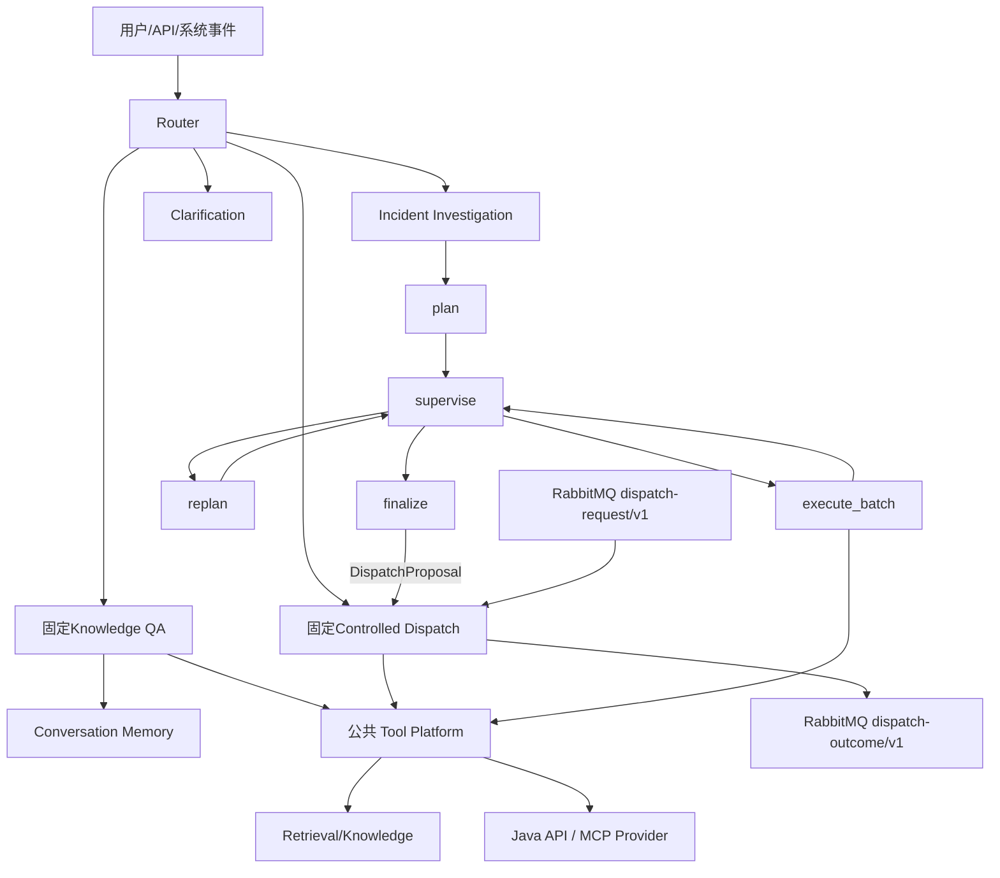

# FlowFix Agent

FlowFix Agent 是设备运维平台旁边的独立 Python Agent 服务。目标架构不是一个万能 Agent，而是“统一入口、三条专业链路、共享 Tool/Memory/安全/评测底座”。

## 三条链路

| 链路 | 目标 | 执行方式 | 状态 |
| --- | --- | --- | --- |
| Knowledge QA | 回答手册、SOP 和历史知识问题 | 固定 RAG Workflow | ✅ 含SQLite多轮记忆 |
| Controlled Dispatch | 对明确工单完成安全派单 | 固定 StateGraph + HITL | ✅ 同步 Java 闭环 + 持久化决策仓库 |
| Incident Investigation & Planning | 调查具体故障并制定处置计划 | Plan-and-Execute + 只读 Multi-Agent | ✅ 生产 Planner/决策端 + 在线 /plan·/run 端点 |

统一自然语言入口两条：`POST /v1/assistant/route` 输出 `KNOWLEDGE_QA / DIRECT_DISPATCH / INCIDENT_INVESTIGATION / NEEDS_CLARIFICATION`（只分类不执行），`POST /v1/assistant/execute` 按路由结果同步编排三链路。显式 QA、Dispatch、Investigation API 仍可直达，但不能绕过链路内部安全校验。

## 当前代码事实

- ✅ Knowledge Ingestion、BM25/Dense、RRF、可选 Rerank、Evidence Selector；
- ✅ 工单知识闭环：Java Transactional Outbox、RabbitMQ、Agent 质量门禁/PII 脱敏、版本化索引、结果回写与案例撤回；
- ✅ 单轮引用 QA、证据不足拒答和离线评测；
- ✅ 确定性派单、版本化 Skill、固定 LangGraph、HITL、7 个 Typed Tool；
- ✅ `dispatch-contract/v1` Java HTTP 同步联调、幂等、`expectedVersion` 和最终 outcome；
- ✅ 持久化派单决策仓库（SQLite 默认 / MySQL 可选，跨重启幂等），Redis Checkpoint 默认开启（复用 Java 侧 6379），本地无 Redis 用 `.env` 关闭；
- ✅ 确定性 Router、公共 Tool Platform、SQLite/MySQL Conversation/Task-Artifact Store；
- ✅ 有界只读 Investigation Tool Loop 与六节点 Planning Runtime（含可恢复人工输入节点）；
- ✅ 可信 Principal 入口、租户归属校验与细粒度 API 权限；生产环境必须配置 `API_AUTH_TOKEN`；
- ✅ Assistant 统一生命周期 outcome/`next_action`、澄清续接与单 trace lineage；
- ✅ Dispatch 审批 TTL 与执行 deadline 分离，恢复时重签执行时限；普通响应不暴露内部 Graph state；
- ✅ Planning 使用 Checkpointer + `interrupt/resume` 实现可恢复人工补充；
- ✅ 链路三完整闭环（D12–D19 + 在线化）：Diagnosis / ImpactSafety / ResourcePlanning 三个真实只读 Worker、三类内容触发 Replan、CompletionGate/WritePolicy、DispatchProposal 转交、14 条 Golden Set、单/多 Agent 公平评测与故障注入；生产 Planner/决策端装配进容器，`/v1/investigation/plan`·`/v1/investigation/run`·`/v1/assistant/execute` 已开放；
- ✅ 规则优先、结构化 LLM 兜底路由（仅规则不确定时调用，失败安全退化为澄清）；
- ✅ MCP Streamable HTTP Server（`/mcp`）与真实远端 MCP Provider Client，能力仍受静态映射和公共 Gateway 约束；
- ✅ RabbitMQ 异步派单链路：持久消息、publisher confirm、手动 ACK、定时重试、DLQ 和 outcome 事件；
- ✅ 多实例运行基线：MySQL 业务存储、Redis Checkpoint/分布式事件租约、RabbitMQ 竞争消费者与配置门禁。

规划能力在代码、测试和评测完成前不能作为已实现成果描述。

## 目标架构



公共 Tool Platform 采用 `Registry -> Resolver -> Policy -> Gateway -> Provider`。MCP 只是 Provider Adapter；动态发现不等于动态授权。FAQ 仍固定调用检索，Dispatch 仍固定执行安全状态图，只有 Investigation 按动态 Task 选择只读 capability。

## 文档导航

- [文档中心](docs/README.md)
- [项目总览](docs/01-overview/project-overview.md)
- [模块地图](docs/01-overview/module-map.md)
- [系统架构](docs/02-architecture/system-architecture.md)
- [三条链路设计](docs/02-architecture/three-chains.md)
- [安全与可靠性边界](docs/02-architecture/safety-and-reliability.md)
- [评测与证据](docs/03-engineering/evaluation.md)
- [秋招量化测试方案](docs/03-engineering/metrics-test-plan.md)
- [运行与演示](docs/03-engineering/runbook.md)
- [秋招项目亮点总表](docs/04-interview/project-highlights.md)
- [设计决策与取舍](docs/04-interview/design-decisions.md)
- [面试表达手册](docs/04-interview/interview-guide.md)
- [项目追问题库](docs/04-interview/question-bank.md)
- [简历与证据索引](docs/04-interview/resume-and-evidence.md)

## 当前源码目录

```text
src/flowfix_agent/
├── api/              # FastAPI 与 Schema
├── bootstrap/        # 唯一依赖装配入口
├── core/             # 配置、错误、上下文和通用合同
├── knowledge/        # 知识摄取和版本
├── retrieval/        # 混合检索与证据选择
├── qa/               # 固定 RAG QA 与多轮会话更新
├── dispatch/         # domain/application/skills/runtime/adapters
├── routing/          # 四类确定性优先路由
├── tools/            # Registry/Resolver/Policy/Gateway/Provider
├── messaging/        # RabbitMQ durable dispatch events, retry and DLQ
├── reliability/      # Redis cross-process leases
├── mcp_server.py     # Read-only Streamable HTTP MCP Server
├── memory/           # Conversation与Task/Artifact SQLite Store
├── investigation/    # 有界只读Tool Loop
├── planning/         # 六节点控制面（含 request_human_input）
├── adapters/         # ES、模型等外部实现
├── observability/    # Trace
└── evaluation/       # QA/Dispatch 离线评测
```

`planning` 已从 Fake 控制面推进到真实 Worker + 三类 Replan + CompletionGate/DispatchProposal 完整闭环（见上方「当前代码事实」）。

## 快速开始

要求：Python 3.12、uv、Docker Desktop。

```bash
uv sync
docker compose -f ../backend/compose.yaml up -d elasticsearch
uv run flowfix-agent ingest
uv run flowfix-agent query '为什么使用 Redisson 锁后仍可能重复抢单？'
uv run flowfix-agent serve
```

服务启动后开放的主要 HTTP 端点：`POST /v1/assistant/route`（规则优先 + LLM 兜底路由）、`POST /v1/assistant/execute`、`POST /v1/qa/query`、`POST /v1/dispatch/start`、`POST /v1/dispatch/events`（RabbitMQ 异步入口）、`POST /v1/investigation/plan`、`POST /v1/investigation/run`；启用 `MCP_SERVER_ENABLED` 后开放 Streamable HTTP `/mcp`。

生产多实例模式使用 `STORE_BACKEND=mysql`、`REDIS_CHECKPOINT_ENABLED=true`、`RABBITMQ_ENABLED=true`、`HA_MODE_ENABLED=true`。此模式下配置校验会拒绝 SQLite、无 Redis 或无 RabbitMQ 的伪高可用组合。当前只称为多实例运行基线，尚无容量和故障切换 SLO；运行方式见 [运行与演示](docs/03-engineering/runbook.md)。

常用验证：

```bash
uv run ruff check .
uv run pytest -q
uv run python scripts/check_docs.py
uv run flowfix-agent evaluate --with-qa
uv run flowfix-agent evaluate-dispatch
LANGGRAPH_STRICT_MSGPACK=true uv run flowfix-agent evaluate-runtime
uv run flowfix-agent evaluate-foundation
# 链路三闭环门禁（D14–D19）
uv run flowfix-agent evaluate-diagnosis
uv run flowfix-agent evaluate-impact-safety
uv run flowfix-agent evaluate-resource-planning
uv run flowfix-agent evaluate-replanning
uv run flowfix-agent evaluate-completion
uv run flowfix-agent evaluate-golden
uv run flowfix-agent evaluate-fairness
# Trace 回放与派单审计（D21）
uv run flowfix-agent trace-replay
# 一键演示（--quick 跳过真实模型 L2 QA）
bash scripts/demo.sh --quick
```

Elasticsearch 复用 `backend` Compose，但使用独立索引。模型凭据通过 `OPENAI_API_KEY` 或未提交的 `MODEL_CONNECTION_FILE` 注入，不能写入文档或 Trace。
